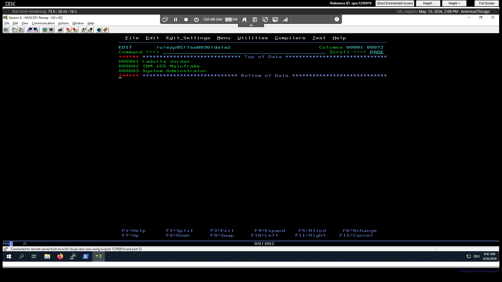
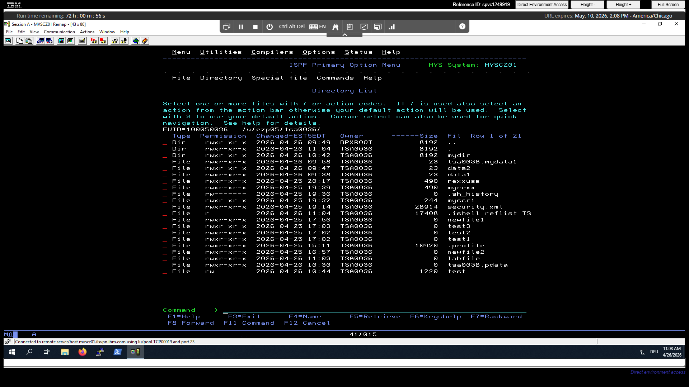

# z-os-uss-learning

Hands-on learning and notes for z/OS UNIX System Services (USS), including file systems, permissions, and mainframe fundamentals.

---

## 📌 Overview

This repository documents my practical experience working with **z/OS UNIX System Services (USS)**. It includes exercises, notes, and examples that helped me understand how UNIX concepts translate into the mainframe environment.

The goal is simple: learn by doing and build a clear understanding of how z/OS and UNIX work together.

---

## 🧠 What I Learned

### 1. z/OS UNIX (USS)

* USS provides a UNIX-like environment inside z/OS
* Standard commands like `ls`, `cd`, and `cat` are supported
* Combines UNIX usability with mainframe reliability

### 2. File System (zFS)

* zFS is used as the UNIX file system in z/OS
* Backed by a **VSAM Linear Data Set (LDS)**
* Provides a hierarchical directory structure similar to UNIX

### 3. Files and Permissions

* Files follow the standard UNIX permission model:

  * `r` (read), `w` (write), `x` (execute)
* Permissions apply to:

  * Owner, Group, Others

Example:

```
rwxr-xr-x
```

### 4. Processes and Threads

* **ASCB** represents a process (address space)
* **TCB** represents a thread within that process
* A single process can have multiple threads

### 5. Links (File Aliases)

* Files can have multiple names using links:

  * Hard link → same file, different name
  * Symbolic link → pointer to another file

### 6. Sticky Bit

* Does NOT mean only root can delete files
* Means:

  * Only file owner, directory owner, or root can delete files in that directory

---

## 🖥️ Practice Work

This repo includes:

* Creating and editing files in USS
* Navigating directories
* Understanding file permissions
* Working with ISPF and USS together

---

## 📸 Screenshots

### Editing a File in USS (ISPF Editor)



### Directory Listing in USS



---

## 🚀 Key Takeaways

* z/OS UNIX behaves like UNIX, but runs on a mainframe
* zFS uses VSAM behind the scenes
* ASCB = process, TCB = thread
* Permissions and links work like standard UNIX
* ISPF + USS together provide a powerful workflow

---

## 📚 Next Steps

* Practice more UNIX commands in USS
* Explore shell scripting
* Learn job control (JCL) alongside USS

---

## 💡 Why This Matters

Understanding USS bridges the gap between modern UNIX systems and traditional mainframe environments. This knowledge is valuable for roles involving enterprise systems, banking, and large-scale infrastructure.

